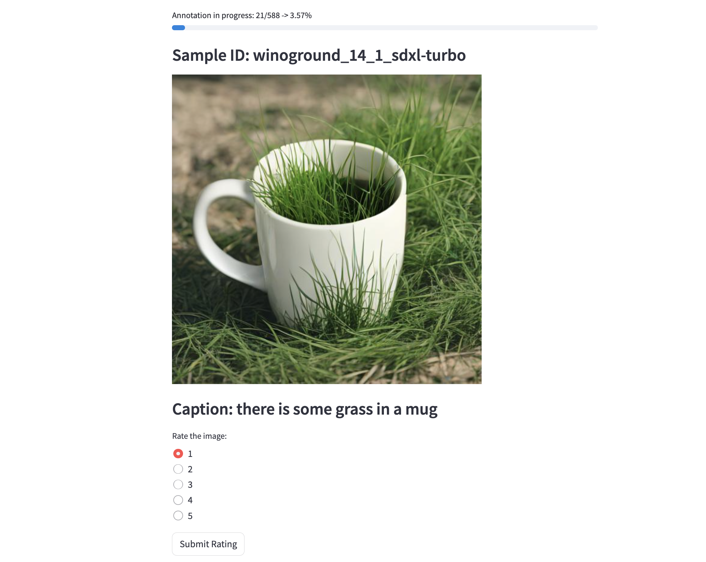

### Install streamlit
```python
pip install streamlit 
```

### Downloading the unannotated image dataset
1. Download assigned dataset [here](https://drive.google.com/drive/folders/1vkFJLx4YqdRTC4x_1SOAoQOA57GbN51Y?usp=sharing). Unzip if neccessary.
2. Create a folder under any directory named ```results```, then move the downloaded dataset folder(s) into the ```results``` directory.
3. Change "root_path" in  ```configs.json``` is set to the directory containing the  ```results/``` folder containing 

### Run streamlit app
Make sure your current directory is under ```annotation-ui/```. 

Your current directory should look like
```
- /annotation-ui
  - app.py
  - configs.json
  - /annotation_res (generated after launch)
Your results folder should look like
- /results
  - /dataset1_name
    - /images
      - wg_0_0_dalle3.jpeg
      - ...
    - dataset1_name-metadata.json
  - ...
```
Then to launch annotation ui, run:
```python
streamlit run app.py
```




### Navigating the streamlit ui
You can return to this page at any time by clicking the 'Return home' button or refreshing the page. Your annotation progress will be saved.

View and download your annotation results in the path:

```./annotation_res/<selected dataset path>-res.json```

Once you are finished annotating, please upload your entire annotation results folder to the following Google Drive [folder](https://drive.google.com/drive/u/0/folders/1nHC7DwReQnypWBM3lYR1QtPfXmZaSRRQ) and rename it to ```annotation_res-<your_name>```.

```./annotation_res/```